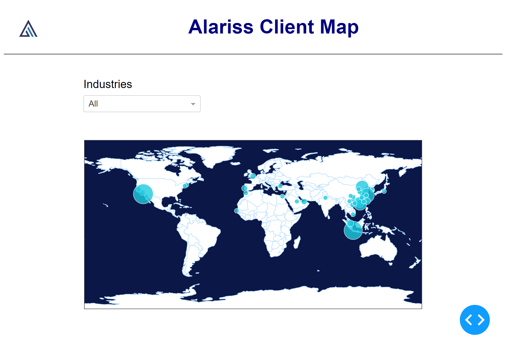
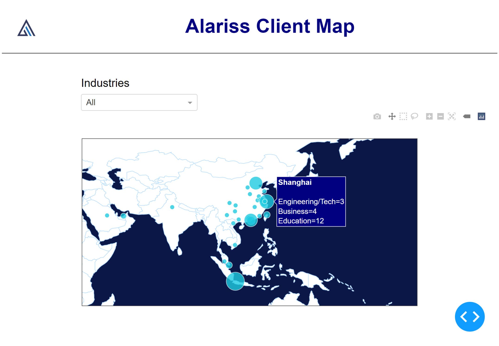

# Alariss-data-vis
A data visualization of Alariss clients throughout the world. Created using plotly.
Click here to view app in browser: https://alariss-client-visual.herokuapp.com/

See below for screenshots of UI.

App upon being loaded:

Hovering the cities displays information of the industries in that city:

